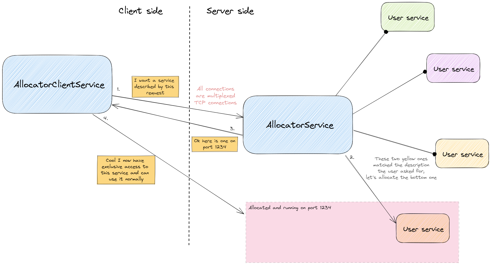

# leaning-tower

## Multiplexed transports

Provides easy use of `tokio-tower`'s multiplexed transport capabilities.

Provide a service with (de)serializable requests and responses, and the multiplexing is done for you.

## Service allocation

Give a bunch of services (i.e. `Vec<S>`) to `AllocatorService`, and use it from a client (or clients) simultaneously.

The server allocates a service for exclusive use as soon as it is available. The client then gets to use the service exclusively on a newly formed TCP connection.

The client side uses `AllocatorClientService`.

The services the client wants to use might differ slightly. Therefore the service must implement a simple trait:

```rust
trait Describable<D> where D: PartialEq {
    fn describe(&self) -> D;
}
```

As a simplified example, consider this:

```rust
#[derive(PartialEq, ...)]
enum Location {
	LivingRoom,
	BedRoom
}

struct AirMoisturizer {
	location: Location
};

impl Describable<Location> for AirMoisturizer {
    fn describe(&self) -> Location {
        self.variant
    }
}
```

The `AllocatorClientService` then takes a request of type `Location`, which the server side looks at.

All matching services will be queued on such that the client gets hold of the first `AirMoisturizer` at the given `Location`.

Non-matching locations are ignored.

## Diagram



## Examples

### Printer

You have a building with some color printers and some black and white printers.

The example shows a situation where clients want to use these, but they only care about getting the job done as soon as possible, and on the correct printer variant.


**Quickstart**

Start the server first in one terminal, then the client in another.

**Explanation**

This example shows how a pretend user service might be implemented (in `examples-lib/src/printer_service.rs`),
and then served by this library.

The **server** shows both how to serve a single resource (service) and several ones.

Typical use is shown: Let the allocator handle many services, and serve it over a multiplexed transport.

The **client** shows how the client side is handled. Note the type alias pattern. The `allocator_call` and `printer_call` functions should also be applicable in most situations.

### Data Discarder

**Quickstart**

Start the server first in one terminal, then the client in another.

**Explanation**

This example shows continous use and is used to check the stability of the library over time.

The **server** creates 60 services:

* 10 "fast" variants
* 20 "medium" variants
* 30 "slow" variants

The only difference is how long their simulated work lasts.

These services are then managed by an `AllocatorService`.

The **client** receives allocated resources and then uses them for some work.

The client then sets up an `AllocatorClientService`.

The client will ask for 150 clients, 50 of each variant.
All of them are requested at the same time, but it's more than the server has available.
The queueing is automatic.

When a client gets a hold of a service, it sends 100 payloads and then stops using it.

Press `ctrl+c` to stop.
